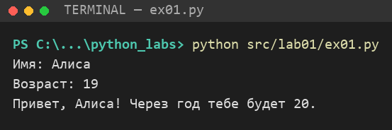
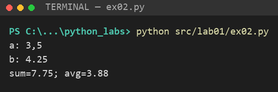
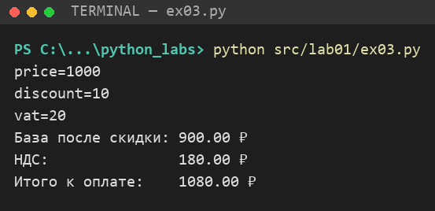
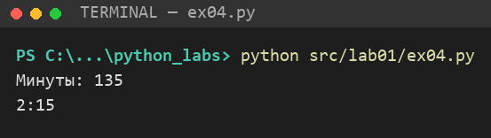
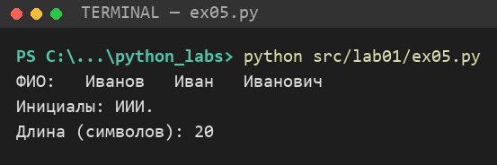
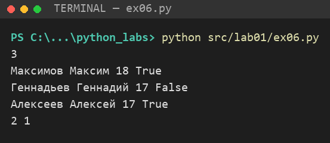
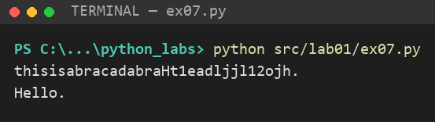

# python_labs

Лабораторные работы по программированию на Python.

Структура репозитория:

```
python_labs/
├─ README.md
├─ src/        # код по заданиям
│  └─ lab01/
└─ images/     # скриншоты работы программ
   └─ lab01/
```

Запуск любого задания из корня репозитория:

```bash
python src/lab01/ex01.py
```

---

# ЛР1 — Ввод/вывод и форматирование

## Задание 1 — Привет и возраст

Файл: [`src/lab01/ex01.py`](src/lab01/ex01.py)

```python
name = input("Имя: ")
age = int(input("Возраст: "))
print(f"Привет, {name}! Через год тебе будет {age + 1}.")
```



*Рис. 1. Работа программы `ex01.py`*

## Задание 2 — Сумма и среднее

Файл: [`src/lab01/ex02.py`](src/lab01/ex02.py)

```python
# заменяем запятую на точку, чтобы float() понял число
a = float(input("a: ").replace(",", "."))
b = float(input("b: ").replace(",", "."))
total = a + b
avg = total / 2
print(f"sum={total:.2f}; avg={avg:.2f}")
```



*Рис. 2. Работа программы `ex02.py`*

## Задание 3 — Чек: скидка и НДС

Файл: [`src/lab01/ex03.py`](src/lab01/ex03.py)

```python
price = float(input("price="))
discount = float(input("discount="))
vat = float(input("vat="))

base = price * (1 - discount / 100)
vat_amount = base * (vat / 100)
total = base + vat_amount

print(f"База после скидки: {base:.2f} ₽")
print(f"НДС:               {vat_amount:.2f} ₽")
print(f"Итого к оплате:    {total:.2f} ₽")
```



*Рис. 3. Работа программы `ex03.py`*

## Задание 4 — Минуты → ЧЧ:ММ

Файл: [`src/lab01/ex04.py`](src/lab01/ex04.py)

```python
m = int(input("Минуты: "))
hours = m // 60
minutes = m % 60
print(f"{hours}:{minutes:02d}")
```



*Рис. 4. Работа программы `ex04.py`*

## Задание 5 — Инициалы и длина строки

Файл: [`src/lab01/ex05.py`](src/lab01/ex05.py)

```python
fio = input("ФИО: ")
# split() без аргументов убирает все лишние пробелы
parts = fio.split()
initials = "".join(part[0].upper() for part in parts)
clean = " ".join(parts)
print(f"Инициалы: {initials}.")
print(f"Длина (символов): {len(clean)}")
```



*Рис. 5. Работа программы `ex05.py`*

## Задание 6* — Подсчёт участников

Файл: [`src/lab01/ex06.py`](src/lab01/ex06.py)

```python
n = int(input())
full_time = 0
part_time = 0
for _ in range(n):
    surname, name, age, is_full_time = input().split()
    if is_full_time == "True":
        full_time += 1
    else:
        part_time += 1
print(full_time, part_time)
```



*Рис. 6. Работа программы `ex06.py`*

## Задание 7* — Расшифровка строки

Файл: [`src/lab01/ex07.py`](src/lab01/ex07.py)

Алгоритм: находим первую заглавную букву (начало строки), затем первую цифру после неё.
Символ сразу за цифрой — второй символ оригинала, отсюда получаем шаг. Дальше берём
символы с этим шагом, пока не встретим точку.

```python
s = input()

# 1) первая заглавная буква — начало исходной строки
start = 0
while not s[start].isupper():
    start += 1

# 2) второй символ стоит сразу после первой цифры (ищем её после заглавной)
digit = start + 1
while not s[digit].isdigit():
    digit += 1
step = digit + 1 - start

# 3) берём символы с этим шагом, пока не дойдём до точки
result = ""
for i in range(start, len(s), step):
    result += s[i]
    if s[i] == ".":
        break
print(result)
```



*Рис. 7. Работа программы `ex07.py`*
