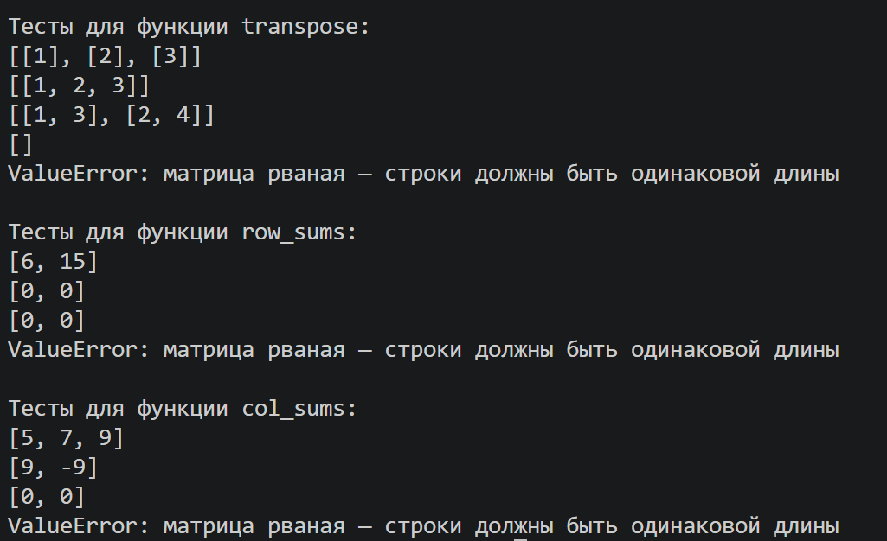
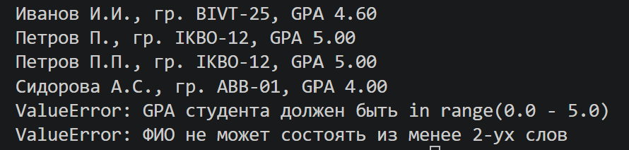

# ЛР2 — Коллекции и матрицы (list/tuple/set/dict)

## Задание A — Списки

Файл: [arrays.py](arrays.py)

### Вернуть кортеж (минимум, максимум).
```py
def min_max(nums: list[float | int]) -> tuple[float | int, float | int]:

    if not nums:
        raise ValueError("список не может быть пуст")

    min_val = max_val = nums[0]
    for num in nums[1:]:
        if num < min_val:
            min_val = num
        if num > max_val:
            max_val = num

    return (min_val, max_val)
```
### Вернуть отсортированный список уникальных значений (по возрастанию).
```py
def unique_sorted(nums: list[float | int]) -> list[float | int]:

    if not nums:
        return []

    unique = []
    for num in nums:
        if num not in unique:
            unique.append(num)

    for i in range(len(unique)):
        for j in range(i + 1, len(unique)):
            if unique[i] > unique[j]:
                unique[i], unique[j] = unique[j], unique[i]

    return unique
```
### «Расплющить» список списков/кортежей в один список по строкам (row-major).
```py
def flatten(mat: list[list | tuple]) -> list:

    result = []
    for row in mat:
        if not isinstance(row, (list, tuple)):
            raise TypeError(f"каждый элемент матрицы должен быть списком или кортежем, дан {type(row).__name__}")
        result.extend(row)
    return result
```

# ----------------------------------------
## Тест-кейсы для задания А
#### Для функции min_max:
```py
print(min_max([3, -1, 5, 5, 0])) # -> (-1, 5)    
print(min_max([42])) # -> (42, 42)        
print(min_max([-5, -2, -9])) # -> (-9, -2)  
print(min_max([1.5, 2, 2.0, -3.1])) # -> (-3.1, 2)
```

#### Для функции unique_sorted:
```py
print(unique_sorted([3, 1, 2, 1, 3])) # -> [1, 2, 3]  
print(unique_sorted([])) # -> []     
print(unique_sorted([-1, -1, 0, 2, 2])) # -> [-1, 0, 2]
print(unique_sorted([1.0, 1, 2.5, 2.5, 0])) # -> [0, 1.0, 2.5]
```
#### Для функции flatten:
```py
test_cases_flatten = [[[1, 2], [3,4]], [[1,2], (3, 4, 5)], [[1], [], [2,3]], [[1, 2], "ab"]]
for test in test_cases_flatten:
    try:
        print(flatten(test))
    except TypeError as error:
        print("TypeError:", error)
```
## Output:


## Задание B — Матрицы

Файл: [matrix.py](matrix.py)

### Функция на проверку правильности матрицы:
```py
def _check_rectangular(mat: list[list[float | int]]) -> int:
    row_length = len(mat[0])
    for row in mat:
        if len(row) != row_length:
            raise ValueError("матрица рваная — строки должны быть одинаковой длины")
    return row_length
```

### Поменять строки и столбцы местами. 
```py
from matrix import _check_rectangular # См. функцию выше

def transpose(mat: list[list[float | int]]) -> list[list]:
    
    if not mat:
        return []

    row_length = _check_rectangular(mat)

    result = []
    for col_idx in range(row_length):
        new_row = []
        for row in mat:
            new_row.append(row[col_idx])
        result.append(new_row)

    return result
```
### Сумма по каждой строке.
```py
from matrix import _check_rectangular # См. функцию выше

def row_sums(mat: list[list[float | int]]) -> list[float]:
    
    if not mat:
        return []

    _check_rectangular(mat)

    return [sum(row) for row in mat]
```
### Сумма по каждому столбцу.
```py
from matrix import _check_rectangular # См. функцию выше

def col_sums(mat: list[list[float | int]]) -> list[float]:
    
    if not mat:
        return []

    row_length = _check_rectangular(mat)

    result = []
    for col_idx in range(row_length):
        col_sum = 0
        for row in mat:
            col_sum += row[col_idx]
        result.append(col_sum)

    return result
```
# ----------------------------------------
## Тест-кейсы для задания B
#### Для функции transpose:
```py
test_Cases_transpose = [[[1, 2, 3]], [[1], [2], [3]], [[1, 2], [3, 4]], [], [[1, 2], [3]]]
for case in test_Cases_transpose:
    try:
        print(transpose(case))
    except ValueError as error:
        print("ValueError:", error)
```
#### Для функции row_sums:
```py
test_Cases_row_sums = [[[1, 2, 3], [4, 5, 6]], [[-1, 1], [10, -10]], [[0, 0], [0, 0]], [[1, 2], [3]]]
for case in test_Cases_row_sums:
    try:
        print(row_sums(case))
    except ValueError as error:
        print("ValueError:", error)
```

#### Для функции col_sums:
```py
test_Cases_col_sums = [[[1, 2, 3], [4, 5, 6]], [[-1, 1], [10, -10]], [[0, 0], [0, 0]], [[1, 2], [3]]]
for case in test_Cases_col_sums:
    try:
        print(col_sums(case))
    except ValueError as error:
        print("ValueError:", error)
```
## Output:


## Задание C — Кортежи: запись студента

Файл: [tuples.py](tuples.py)

```py
def format_record(rec: tuple[str, str, float]) -> str:
    fio, group, gpa = rec # кортеж с данными о user'e
    
    if not isinstance(fio, str) or not isinstance(group, str):
        raise TypeError('ФИО и группа студента должны быть в строчном виде данных')
    if not (0.0 <= gpa <= 5.0):
        raise ValueError('GPA студента должен быть in range(0.0 - 5.0)')
    
    parts_fio = fio.split()
    parts_fio = [p for p in parts_fio if p]

    if len(parts_fio) < 2:
        raise ValueError('ФИО не может состоять из менее 2-ух слов')
    
    surname = parts_fio[0].capitalize()
    initials = '.'.join(p[0].upper() for p in parts_fio[1:]) + '.' 

    gpa_s = f"{gpa:.2f}"

    return f"{surname} {initials}, гр. {group}, GPA {gpa_s}" 
```
# ----------------------------------------
## Тест-кейсы для задания C
#### Для функции format_record:
```py
test_cases = [("Иванов Иван Иванович", "BIVT-25", 4.6),
("Петров Пётр", "IKBO-12", 5.0), 
("Петров Пётр Петрович", "IKBO-12", 5.0), ("  сидорова  анна   сергеевна ", "ABB-01", 3.999), ("Курин Вильян Энкорденко", "BIVT-33", 6), ("Димасик", "DSBA-26", 2)] 

for case in test_cases:
    try:
        print(format_record(case))
    except ValueError as er1:
        print('ValueError:', er1)
    except TypeError as er2:
        print('TypeError:', er2)
```
## Output:

